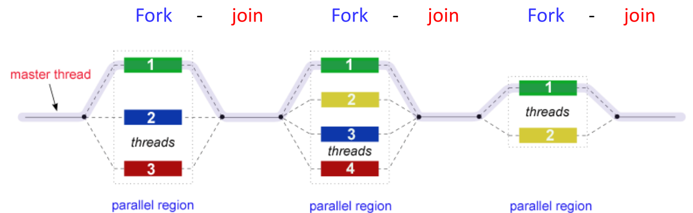
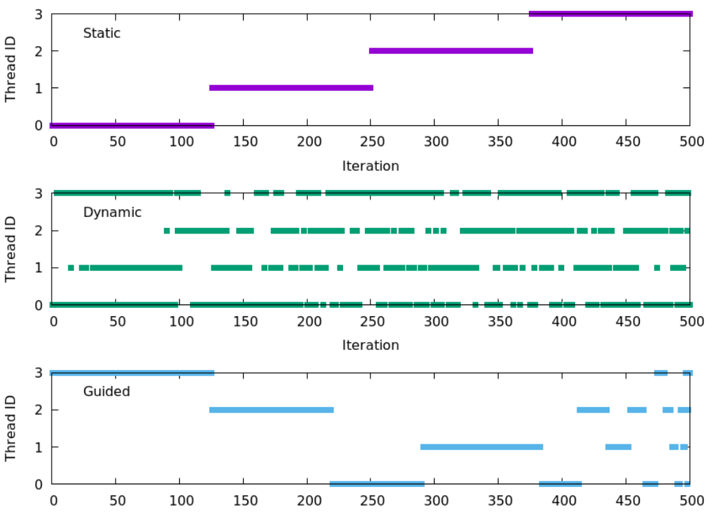
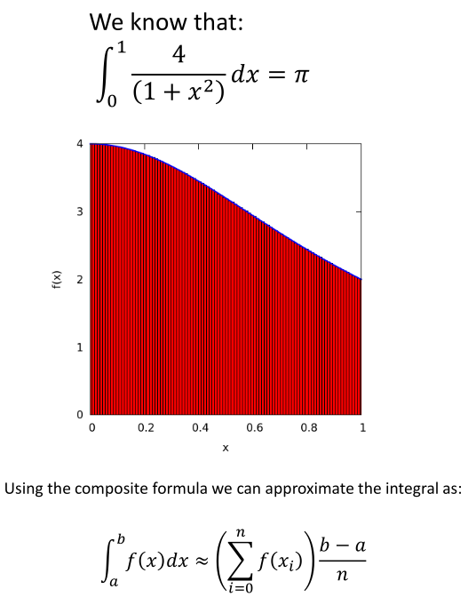
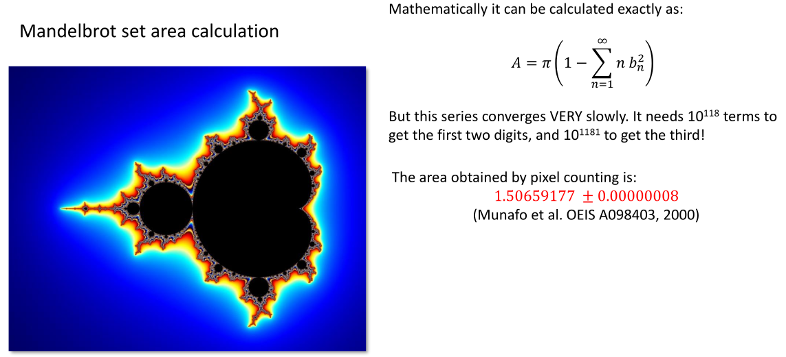
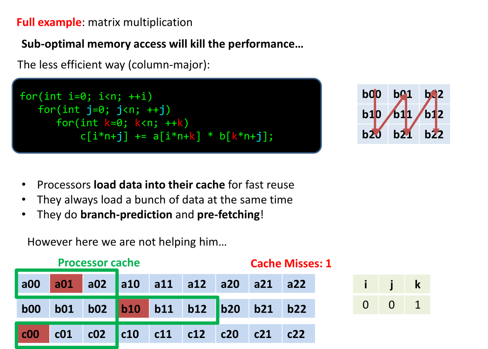
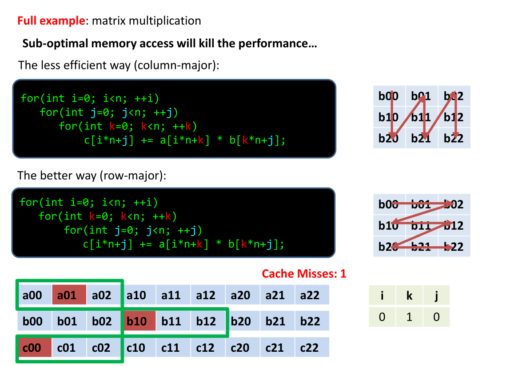
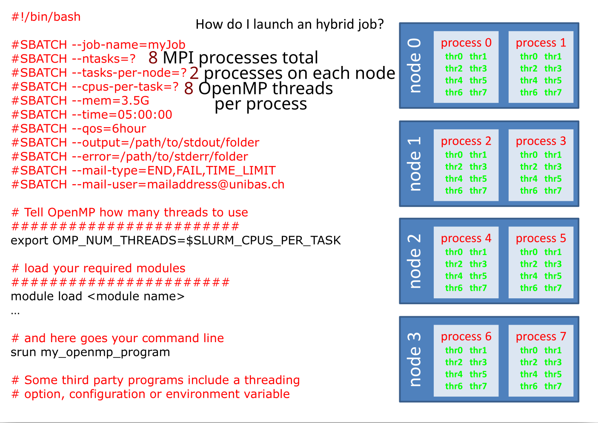

# Intro to openMP in Fortran, Python/Numba, and C++¹

## Outline

1. [Intro](#intro)
2. [Calculating pi with parallelization in Fortran](#1-calculating-pi-with-parallelization-in-fortran)
3. [Mandelbrot set area calculation in Fortran](#2-mandelbrot-set-area-calculation-in-fortran)
4. [Calculating pi in Python/Numba](#3-calculating-pi-in-pythonnumba)
5. [Matrix Multiplication in C++ (CPU Cache)](#4-matrix-multiplication-in-c-cpu-cache)
6. [Using OpenMP together with MPI on SLURM](#5-using-openmp-together-with-mpi-on-slurm)
7. [Recommended references](#6-recommended-references)

## Intro

OpenMP is fundamentally based on fork-join: one thread in serial sections, a team in parallel regions, then join/sync at region end. In modern OpenMP, tasking can make execution look less “strictly blocky,” but it still runs within that fork-join framework.

<figure>
<p align="center">
  
</p>
  <figcaption align="center"><b>Figure.</b> OpenMP fork-join execution model.</figcaption>
</figure>

When it comes to OpenMP scheduling behavior - choose static for regular loops, dynamic/guided for uneven loops (like Mandelbrot), and tune chunk size to trade off overhead vs balance.

<figure>
<p align="center">
  
</p>
  <figcaption align="center"><b>Figure.</b> OpenMP scheduling behavior.</figcaption>
</figure>

-----------------------------


## 1. Calculating pi with parallelization in Fortran

<figure>
<p align="center">
  
</p>
  <figcaption align="center"><b>Figure.</b> π computation with midpoint integration; parallel OpenMP reduction speeds up execution while keeping the same numerical result (up to tiny floating-point differences).</figcaption>
</figure>


Using a single CPU core:
```bash
gfortran pi.f90 -o pi
# Parameters:
#-O3: enables high-level optimization for faster code, usually at the cost of longer compile time
#-fopenmp: turns on OpenMP support, so the compiler recognizes OpenMP directives and links the OpenMP runtime
#pi.f90: the source file to compile
#-o pi: names the output executable pi instead of the default a.out
#and then:
time ./pi
#   3.1415926535899708        5.6543194337129184E-014
#
#real    0m2.216s
#user    0m2.207s
#sys     0m0.008s
```

8 CPU cores:
```bash
export OMP_NUM_THREADS=8
gfortran -O3 -fopenmp pi.f90 -o pi
time ./pi
#   3.1415926535899708        5.6543194337129184E-014
#
#real    0m2.207s
#user    0m2.183s
#sys     0m0.010s
```
I's slightly faster.


## 2. Mandelbrot set area calculation in Fortran

<figure>
<p align="center">
  
</p>
  <figcaption align="center"><b>Figure.</b> Mandelbrot area is a strong OpenMP case study: although an exact mathematical expression exists, it converges too slowly for practical use, so we estimate area numerically by sampling points. Each point is independent, which makes the algorithm parallel-friendly, but the work per point is uneven (boundary points need more iterations).</figcaption>
</figure>


No parallelization:
```bash
gfortran mandelbrot.f90 -o mandelbrot_serial
time ./mandelbrot_serial
#   1.0000000000000001E-005           0
# area:    1.5092339062500000          2926767
# error:    7.5461695312499999E-004
#
#real    0m8.853s
#user    0m8.799s
#sys     0m0.048s  
```

With parallelization:
```bash
export OMP_NUM_THREADS=8
gfortran -fopenmp mandelbrot.f90 -o mandelbrot_parallel
time ./mandelbrot_parallel
katwre@katwre-XPS-13-9350:~/projects/openmp_course$ time ./mandelbrot_parallel
   1.0000000000000001E-005           0
 area:    1.5092339062500000          2926767
 error:    7.5461695312499999E-004

real    0m3.511s
user    0m8.964s
sys     0m0.039s
```

In this exercise, points near the Mandelbrot boundary require more iterations, so some threads run longer than others. This workload imbalance is why `dynamic` or `guided` scheduling is often better than static scheduling for Mandelbrot computations.


## 3. Calculating pi in Python/Numba

Numba accelerates Python numerical loops by compiling them to machine code at runtime (JIT), often reaching near-C/C++ performance for array-heavy workloads. It works especially well with NumPy, but has limitations for some features and e.g. pandas objects.

```bash
time python3 python_serial.py
#func: starting (from 1 to 300000000)
#func1: finishing 2.250000003355443e+16
#
#real    0m5.205s
#user    0m5.172s
#sys     0m0.011s
```

```bash
# Install Numba if not installed yet:
#uv venv
#uv pip install numba
#source .venv/bin/activate
time python3 python_numba.py
#func1: starting
#func1: finishing 2.2500000070534588e+16
#
#real    0m1.116s
#user    0m1.042s
#sys     0m0.078s
```

## 4. Matrix Multiplication in C++ (CPU Cache)

Before parallelizing, fix data locality - memory access pattern often dominates runtime. Many times, good CPU optimization gives big wins before GPUs are needed; optimize CPU first, then move to GPU only if performance is still insufficient and the workload fits GPU execution.

Here we multiplies two dense ($n \times n$) matrices $m1$ and $m2$, storing the result in $m3$. We compared different implementations - `naive` is slower because loop order causes poor cache locality, `order` is faster because it traverses memory contiguously; same algorithm, better memory access

<figure>
<p align="center">
  
  
</p>
  <figcaption align="center"><b>Figure.</b> Upper: The naive loop order ($i-j-k$) accesses $B[k][j]$ with large strides in row-major memory, so cache reuse is poor and performance drops. Below: The reordered loop $(i-k-j)$ makes $j$ the innermost loop, so $B[k][j]$ and $C[i][j]$ are accessed contiguously; this improves spatial locality and prefetch efficiency.</figcaption>
</figure>


Here, we miss a lot of cache on the 3 processors because of the implemented loops: 
```bash
cd matmul/matmul_cpp
make naive
time ./naive 1024
#-92.410698 2.825141
#
#real    0m2.895s
#user    0m2.883s
#sys     0m0.010s
```
It's so much faster and it's optimizing only the memory access!
```bash
cd matmul/matmul_cpp
make order
time ./order 1024
#-92.410698 0.280126
#
#real    0m0.326s
#user    0m0.319s
#sys     0m0.007s
```

## 5. Using OpenMP together with MPI on SLURM


How do I launch a hybrid job using openMP+MPI on SLURM? This example configuration maps to: 4 nodes × 2 ranks/node × 8 threads/rank = 64 CPU cores total. Use MPI to parallel in a HPC compting cluster, and use openMP within the node - it's the most efficient way for HPC system. Task = mpi process, and cpu-per-task = OpenMP thread per MPI process.

<figure>
<p align="center">
  
</p>
  <figcaption align="center"><b>Figure.</b> Hybrid MPI+OpenMP layout on SLURM (4 nodes × 2 ranks/node × 8 threads/rank).</figcaption>
</figure>


## 6. Recommended references

### Main reference
- [OpenMP API Reference Guide 6.0](https://www.openmp.org/wp-content/uploads/OpenMP-RefGuide-6.0-OMP60SC24-web.pdf)

### Examples and tutorials
- [OpenMP Examples 6.0](https://www.openmp.org/wp-content/uploads/openmp-examples-6.0.pdf)
- [LLNL OpenMP Tutorial](https://hpc-tutorials.llnl.gov/openmp/)
- [OpenMP YouTube Playlist](https://www.youtube.com/playlist?list=PLLX-Q6B8xqZ8n8bwjGdzBJ25X2utwnoEG)
- [Numba 5-minute guide](https://numba.pydata.org/numba-doc/dev/user/5minguide.html)
- [mpi4py tutorial](https://mpi4py.readthedocs.io/en/stable/tutorial.html)

### Book
- The OpenMP Common Core: Making OpenMP Simple Again (Mattson et al., 2019)


------------------------

¹Implemented as part of the workshops at the [Swiss Institute of Bioinformatics (SIB) workshop First Steps in Parallelization with OpenMP](https://www.sib.swiss/training/course/20260511_OPEMP)